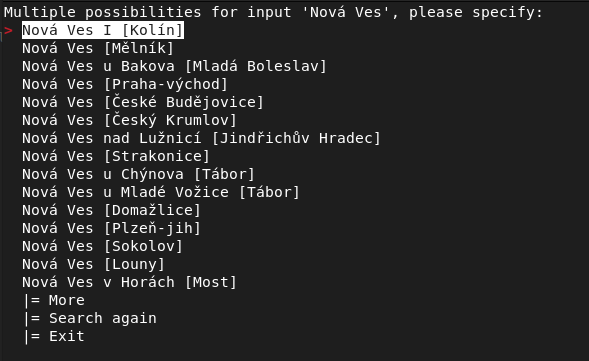
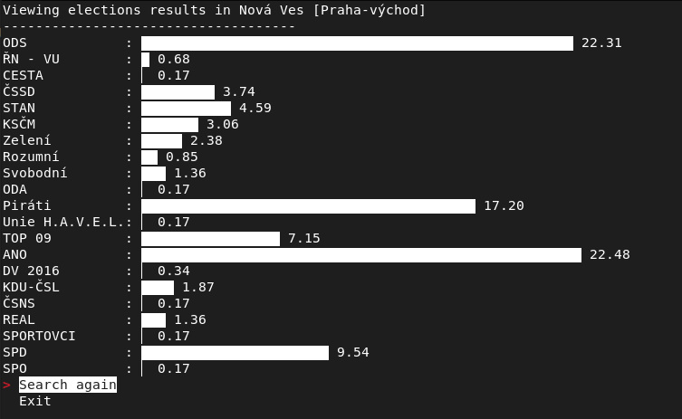
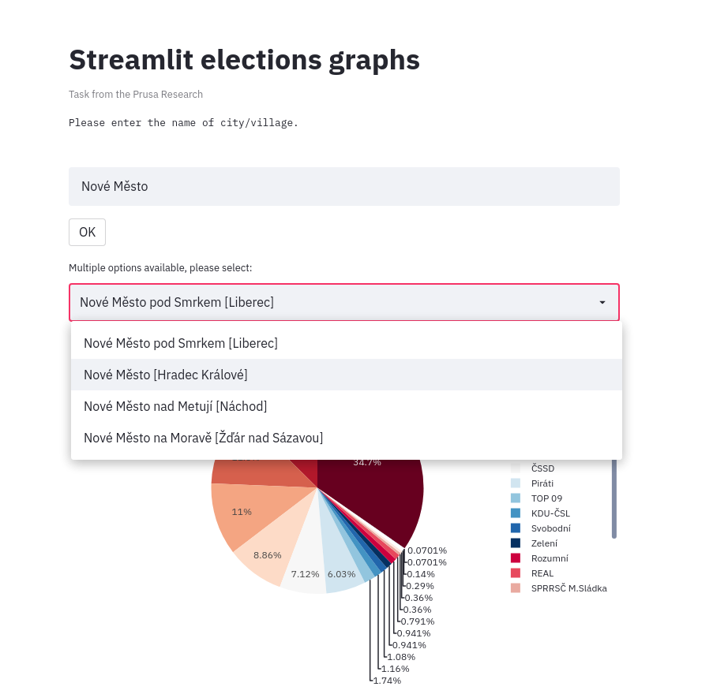
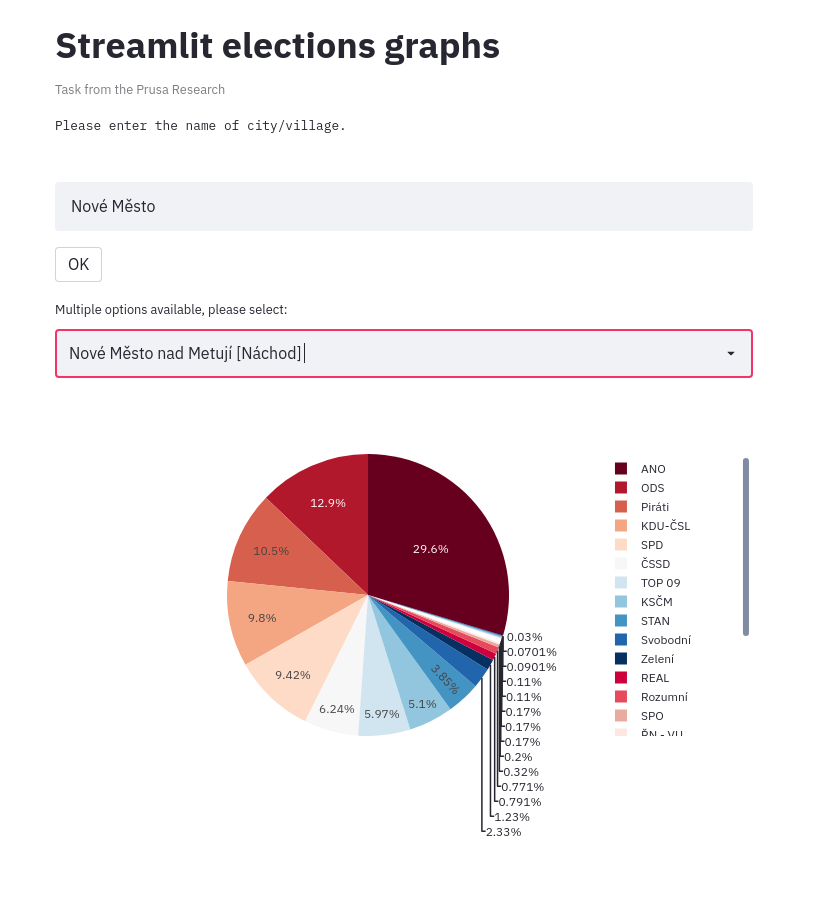

# Streamlit elections grapher 

This is my solution of a task from Prusa Research job interview. It is not perfect nor flawless - it would need a lot of improvemets. If you are looking for an inspiration, it's fine. There is nothing really to copy though. Better to write it yourself :) 

## Task details: 

- Napište command line utilitu, která pro zadaný název obce zobrazí barevný graf výsledků voleb.
- Zajímá nás procentní zisk politických stran v rámci dané obce.
- Jako zdroj dat použijte [volby.cz](https://volby.cz/pls/ps2017nss/ps?xjazyk=CZ)
- strojově čitelná data jsou k dispozici [tady](https://volby.cz/opendata/ps2017nss/ps2017nss_opendata.htm)

### Poznámky: 

- vstup může být interaktivní nebo přes command line argument
- graf postačí sloupcový, nějaký pěkně formátovaný barevný výstup do konzole
- předpokládejme, že data volebních zisků jsou proměnná, jako kdyby byla právě sčítána. Jinými slovy, utilita by měla volební zisky vždy načítat ze stránek volby.cz
- naopak číselník obcí s jejich názvy a kódy můžete považovat za statický
- názvy obcí v ČR nejsou unikátní, v případě zadaní takového jména ať aplikace nechá uživatele interaktivně vybrat tu správnou.
- plus bude, pokud pří opakovaném spuštění pro další obce budou zachované barvy u jednotlivých stran.


## My solution

- Fetching all the data on the start of the app (not ideal, takes some time to run, but then searching is very fast)
- Able to manage similar named places (e.g. 'Nová Ves') and let user select the right one

### Command line interface
- Place could be passed as ```--place=Praha``` argument (case sensitive, search with diacritics) or typed down to the CLI interface (using [simple term menu](https://pypi.org/project/simple-term-menu/))

 

- Plotting the graph using termgraph. Spent a lot of time here, it's more complicated than plot it using plotly (at least for me).

 
 
### Web interface using [streamlit](https://streamlit.io/)
- Running in a web browser, looks better, more intuitive
- Can select from selectbox when multiple options available

 

- Plotting graph using plotly 

 


# Installation

1) Clone/download (and unzip) this repo to your computer
2) Open terminal and navigate to the directory where you clonned/extracted the repo 
3) execute ```pip install -r requirements.txt``` to install dependences

# Run 

```python
python ./main.py                 # for command line version 
python ./main.py --streamlit     # for web version 
```